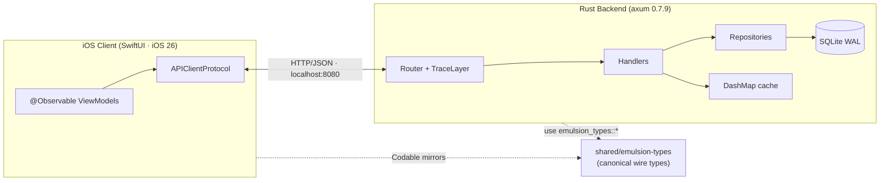

<div align="center">

# emulsion

**A native iOS portfolio app, backed by a Rust API server, built in a Bazel monorepo.**

*The light-sensitive layer where an image takes permanent form.*

[](https://www.rust-lang.org)
[](https://swift.org)
[](https://developer.apple.com/ios/)
[](https://github.com/tokio-rs/axum)
[](https://www.sqlite.org)
[](https://bazel.build)
[](#how-to-run-tests)

<br />

<table>
<tr>
<td></td>
<td></td>
</tr>
</table>

</div>

---

## Contents

1. [What this is](#what-this-is)
2. [Repository structure](#repository-structure)
3. [How to build and run](#how-to-build-and-run)
4. [How to run tests](#how-to-run-tests)
5. [Assumptions and limitations](#assumptions-and-limitations)
6. [Architecture](#architecture)
7. [Highlights](#highlights)
8. [Stack](#stack)
9. [API](#api)
10. [Performance](#performance)
11. [Documentation](#documentation)

---

## What this is

A native **iOS** portfolio app (SwiftUI, iOS 26) talking over local HTTP/JSON to a **Rust** API server (axum, SQLite WAL), with a shared **Rust types** crate that defines the wire contract once. Built in a single **Bazel** monorepo alongside Cargo + Xcode for local iteration.

Seeded with real CV content for Richard Lao. Submitted as a **24-hour take-home** for Lapse — the goal is a working foundation that explains itself, not feature completeness.

End-to-end working flow:

- **Polaroid TLDR card** — swipe-or-tap entry point on the home tab.
- **Portfolio detail** — bio, experience, skills, projects, FAQs, "leave a note", AMA inbox.
- **Real backend** — every screen makes an HTTP call. Counters increment atomically. Cache invalidates on writes.

## Repository structure

```
emulsion/
├── apps/ios/                  SwiftUI app · MVVM · APIClientProtocol
│   ├── Sources/               Views, ViewModels, APIClient, Models, Theme
│   ├── Tests/                 XCTest · 18 tests · MockAPIClient
│   └── PortfolioApp.xcodeproj Hand-rolled pbxproj (no SPM)
├── services/portfolio-api/    Rust axum backend · port 8080
│   ├── src/handlers/          extract → repo → map error → Json
│   ├── src/repositories/      SQL queries, atomic counter updates
│   ├── src/routes/tests.rs    HTTP integration tests via tower::ServiceExt
│   ├── migrations/            sqlx migrations (schema · counters · FK indexes)
│   └── BUILD                  bazel rust_binary + rust_test
├── shared/emulsion-types/     UniFFI Rust crate · canonical wire types
├── tools/seed/                Populates SQLite from embedded CV JSON
├── docs/
│   ├── system-design.md       Architecture, cache, latency, shared layer
│   ├── retrospective.md       Decisions, tradeoffs, post-script
│   ├── test-plan.md           Coverage by tier
│   └── screenshots/           README hero images
├── AGENTS.md                  Conventions for AI coding agents
├── CLAUDE.md                  Build/test commands and conventions
├── MODULE.bazel               Bzlmod deps — rules_rust, rules_apple, rules_swift
├── Cargo.toml                 Workspace root + release profile (LTO, strip)
├── run.sh                     macOS one-shot: prereqs → seed → build → run
└── run.bat                    Windows backend-only equivalent
```

## How to build and run

### macOS — full stack (recommended)

```bash
./run.sh
```

This script: checks prerequisites (Rust, Xcode), seeds `dev.db` if missing, builds the backend + iOS app, and starts the server on `localhost:8080`. Then:

```bash
open apps/ios/PortfolioApp.xcodeproj
# ⌘R to run on iPhone 17 Pro Simulator
```

### Bazel (canonical monorepo build)

```bash
bazel build //services/portfolio-api:server         # Rust binary
bazel build //apps/ios:app                           # iOS .ipa
bazel build //shared/emulsion-types:emulsion_types   # Shared types crate
```

Bazel and Cargo coexist intentionally — Bazel is the canonical build, Cargo is for fast inner-loop iteration.

### Manual (Cargo + Xcode)

```bash
cargo run -p seed              # creates dev.db, applies migrations, seeds CV
cargo run -p portfolio-api     # starts on http://localhost:8080
open apps/ios/PortfolioApp.xcodeproj
```

### Windows (backend only)

```
run.bat
```

iOS requires macOS + Xcode.

## How to run tests

| Suite | Count | Command |
|---|---|---|
| Backend repo + cache | 16 | `cargo test -p portfolio-api` |
| Backend DB pragma | 1 | (in same suite — asserts `init_pool_with_url` applies pragmas) |
| Backend HTTP integration | 5 | (in same suite — `tower::ServiceExt::oneshot` against the live router) |
| Shared types | 4 | `cargo test -p emulsion-types` |
| iOS models / APIClient / ViewModels | 12 / 2 / 4 | `xcodebuild test` with `MockAPIClient: APIClientProtocol` |

Run everything:

```bash
cargo test --workspace          # 26 Rust tests (22 backend + 4 shared types)
bazel test //...                # 2 Bazel test targets aggregating the Rust suites
xcodebuild test \
  -project apps/ios/PortfolioApp.xcodeproj \
  -scheme PortfolioApp \
  -destination 'platform=iOS Simulator,name=iPhone 17 Pro'   # 18 iOS tests
```

Full plan, including what isn't tested and why: [`docs/test-plan.md`](docs/test-plan.md).

## Assumptions and limitations

**Assumptions baked in:**

- Single user, single server, localhost only. No HTTPS, no multi-tenancy, no auth beyond an `X-Owner-Token` header that's checked for presence (not value) on the notes listing.
- Dataset is small and fixed (1 portfolio, 3 projects, 6 Q&As, a handful of conversations). All endpoints return full result sets — no pagination.
- Inbox conversations are seeded "theatre" data; the AMA flow does write back, but the conversation list itself is read-only by design (`"theatre": true` flag in the response).
- macOS + Xcode is the dev environment. iOS app requires the Simulator; Windows users can still run the backend.

**Known limitations:**

- **No HTTPS.** iOS uses an `NSAllowsLocalNetworking` ATS exception.
- **In-process cache only.** `DashMap` is per-process; no Redis / distributed cache.
- **Q&A "fuzzy" match is `LIKE '%query%'`** — case-insensitive but not real fuzzy. FTS5 / trigram / vectors are the migration path.
- **iOS shared-types migration not finished.** Backend uses `emulsion_types::PortfolioResponse`. iOS still uses its own Codable mirrors. The xcframework exists; the pbxproj entry is the missing step.
- **Bazel iOS test target.** Hand-rolled pbxproj makes `ios_unit_test` painful. iOS tests run via `xcodebuild test` only; `bazel test //...` covers the Rust suites.
- **`tools/seed`** uses compile-time path macros (`sqlx::migrate!`, `include_str!`) that don't resolve in Bazel's sandbox; tagged `manual` and run via Cargo only.

What I'd change with more time is documented in [`docs/retrospective.md`](docs/retrospective.md).

---

## Architecture



**Read path.** `PortfolioViewModel.load()` → `URLSession` → `GET /v1/portfolios/1` → cache check → `tokio::join!` over portfolio + experiences + skills queries → typed `PortfolioResponse` → SwiftUI re-render.

**Write path (project view).** `POST /v1/projects/:id/view` → atomic `UPDATE … SET col = col + 1` → `cache.invalidate_prefix("projects:")`. `GET /v1/projects/:id` is pure and cacheable; the side-effecting view increment lives on its own POST.

See [`docs/system-design.md`](docs/system-design.md) for the full design.

## Highlights

- **End-to-end working system.** Every screen hits a real backend.
- **Shared platform layer is wired, not decorative.** Backend `get_portfolio` returns `Json<emulsion_types::PortfolioResponse>`. `From<RowType> for emulsion_types::CanonicalType` impls make schema drift a compile error.
- **Latency-conscious backend.** WAL-mode SQLite tuned with `synchronous = NORMAL`, `busy_timeout = 5s`, `foreign_keys = ON`, 16 MB cache, B-tree indexes on every FK column.
- **Cache-aside reads.** `DashMap` lock-free in-process cache with prefix invalidation. Keys live in a typed `cache::keys` module.
- **Bazel builds both sides.** Backend binary, iOS .ipa, and shared-types library all produced by Bazel. UniFFI scaffolding is feature-gated so the shared crate is sandbox-buildable.
- **Tests that go through the router.** `tower::ServiceExt::oneshot` exercises real handler + extractor + JSON wiring. iOS ViewModels are mocked through `APIClientProtocol`. Shared types have a wire-format regression guard.
- **Agent-ready.** [`AGENTS.md`](AGENTS.md) documents conventions, file layout, and patterns for AI coding agents.

## Stack

| Layer | Tech | Notes |
|---|---|---|
| **iOS** | SwiftUI · iOS 26 · MVVM with `@Observable` | Zero third-party deps. `URLSession` networking. `LapseTheme` enum for visual constants. |
| **Backend** | Rust 1.95 · axum 0.7.9 · sqlx 0.8 | Single-binary tokio server. SQLite WAL. `tower-http` `TraceLayer` for per-request logs. |
| **Shared** | UniFFI 0.28 · feature-gated | Wire types defined once in Rust. UDL schema → Swift xcframework via `generate-bindings.sh`. |
| **Build** | Bazel 9.1.0 (Bzlmod) · Cargo workspace · Xcode | `rules_rust 0.70`, `rules_apple 4.5.3`, `rules_swift 3.6.1`. |
| **Aesthetic** | Polaroid/film | Warm off-whites, grain overlay, editorial serif. Code-only — no asset catalog. |

## API

| Method | Path | Description |
|---|---|---|
| `GET` | `/health` | Liveness check |
| `GET` | `/v1/portfolios/:id` | Portfolio + experiences + skills (typed `PortfolioResponse`) |
| `POST` | `/v1/portfolios/:id/view` | Increment portfolio view count |
| `POST` | `/v1/portfolios/:id/interested` | Increment portfolio interest count |
| `GET` | `/v1/portfolios/:id/projects` | Project list |
| `GET` | `/v1/projects/:id` | Project detail (pure, cacheable) |
| `POST` | `/v1/projects/:id/view` | Increment project view count |
| `POST` | `/v1/projects/:id/interested` | Increment project interest count |
| `GET` | `/v1/portfolios/:id/qa` | Canned FAQ pairs |
| `POST` | `/v1/portfolios/:id/qa/ask` | Fuzzy-match Q&A |
| `POST` | `/v1/portfolios/:id/ama` | Submit a free-form AMA question |
| `POST` | `/v1/portfolios/:id/notes` | Leave a note |
| `GET` | `/v1/portfolios/:id/notes` | List notes (requires `X-Owner-Token`) |
| `GET` | `/v1/portfolios/:id/conversations` | Inbox conversations |
| `GET` | `/v1/conversations/:id/messages` | Conversation thread |
| `POST` | `/v1/conversations/:id/messages` | Send a message |

## Performance

- **WAL + tuned pragmas** at `init_pool()` in `db.rs`: `synchronous = NORMAL`, `busy_timeout = 5s`, `foreign_keys = ON`, `temp_store = MEMORY`, 16 MB page cache.
- **B-tree indexes** on every `portfolio_id` and `conversation_id` filter column. `EXPLAIN QUERY PLAN` reports `SEARCH … USING INDEX`.
- **Concurrent fan-out.** `get_portfolio` issues 3 queries via `tokio::join!`. Wall-clock = max(3) instead of sum.
- **Atomic counters.** `UPDATE … SET col = col + 1` — no read-modify-write, no transaction needed.
- **Stripped release binary.** Thin LTO + `codegen-units = 1` + `strip = "symbols"` + `panic = "abort"` produces a ~3.8 MB binary.

## Documentation

| | |
|---|---|
| [`docs/system-design.md`](docs/system-design.md) | Architecture, data flow, cache strategy, latency considerations, known limitations |
| [`docs/retrospective.md`](docs/retrospective.md) | Phase-by-phase decisions, tradeoffs, what I'd change with more time |
| [`docs/test-plan.md`](docs/test-plan.md) | Coverage by tier, what's tested vs. deliberately not |
| [`AGENTS.md`](AGENTS.md) | Conventions for AI coding agents — naming, patterns, common tasks |
| [`CLAUDE.md`](CLAUDE.md) | Build/test commands and conventions |

---

<div align="center">

Built by [Richard Lao](mailto:richard@seractech.co.uk) · 24-hour take-home for Lapse.

</div>
