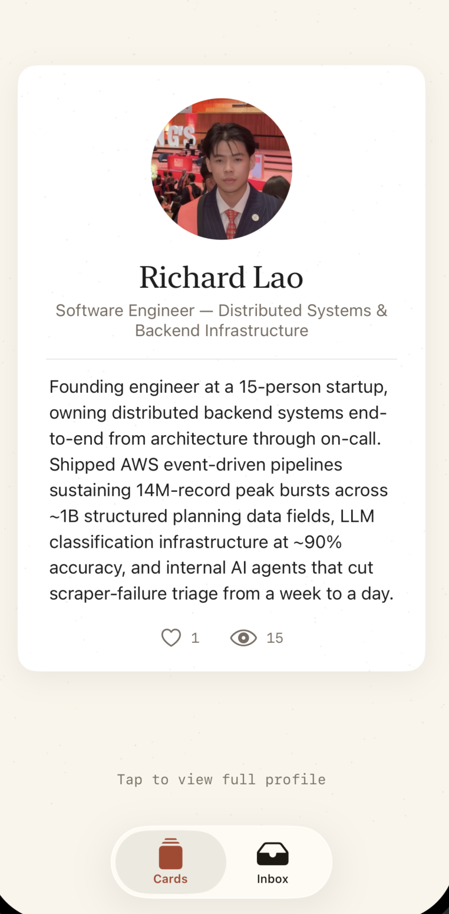
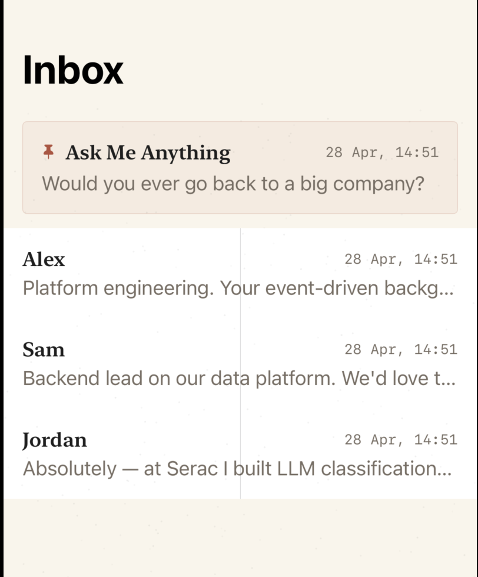

<div align="center">

# emulsion

*The light-sensitive layer where an image takes permanent form.*

[](https://www.rust-lang.org)
[](https://swift.org)
[](https://developer.apple.com/ios/)
[](https://www.sqlite.org)

</div>

---

## Screenshots

<p align="center">
  
  &nbsp;&nbsp;&nbsp;&nbsp;
  
</p>

---

## TLDR

A native iOS portfolio app with a polaroid/film aesthetic, backed by a Rust API server over local HTTP. Content is seeded from a real CV — the app is a usable artifact, not throwaway code.

---

## Stack

| | Technology |
|---|---|
| **iOS** | SwiftUI · iOS 26 · MVVM · no third-party deps |
| **Backend** | Rust · axum 0.7.9 · SQLite (WAL) via sqlx · DashMap cache |
| **Build** | Cargo workspaces · Xcode · Bazel config present |
| **Aesthetic** | Polaroid/film — warm off-whites, grain overlay, editorial serif |

---

## Structure

```
emulsion/
├── apps/ios/                SwiftUI app (Xcode project)
├── services/portfolio-api/  Rust · axum · SQLite
├── tools/seed/              Seeds SQLite from CV JSON
├── docs/                    System design, test plan, screenshots
├── run.sh                   macOS setup & run
└── run.bat                  Windows setup & run (backend only)
```

---

## Quick Start

### macOS (full stack)

```bash
./run.sh
```

Checks prerequisites, sets up the database, builds the backend + iOS app, and starts the server on `localhost:8080`. Open the Xcode project and hit Cmd+R to launch the iOS Simulator.

### Windows (backend only)

```
run.bat
```

Builds and runs the Rust API server. The iOS app requires macOS + Xcode.

### Manual

```bash
# 1. Set up the database
cd services/portfolio-api
cargo sqlx database create
cargo sqlx migrate run
cd ../..
cargo run -p seed

# 2. Start the API
cargo run -p portfolio-api
# → http://localhost:8080

# 3. Open the iOS app (macOS only)
open apps/ios/PortfolioApp.xcodeproj
# Cmd+R to run on iPhone 17 Pro Simulator
```

---

## API Endpoints

| Method | Path | Description |
|--------|------|-------------|
| GET | `/health` | Health check |
| GET | `/v1/portfolios/:id` | Portfolio with experiences + skills |
| GET | `/v1/portfolios/:id/projects` | Project list |
| GET | `/v1/projects/:id` | Project detail |
| POST | `/v1/projects/:id/view` | Increment view count |
| POST | `/v1/projects/:id/interested` | Increment interest count |
| GET | `/v1/portfolios/:id/qa` | FAQ pairs |
| POST | `/v1/portfolios/:id/qa/ask` | Fuzzy-match Q&A |
| POST | `/v1/portfolios/:id/notes` | Leave a note |
| GET | `/v1/portfolios/:id/conversations` | Inbox conversations |
| GET | `/v1/conversations/:id/messages` | Conversation thread |
| POST | `/v1/conversations/:id/messages` | Send a message |

---

## Architecture

See [`docs/system-design.md`](docs/system-design.md) for the full design document.
